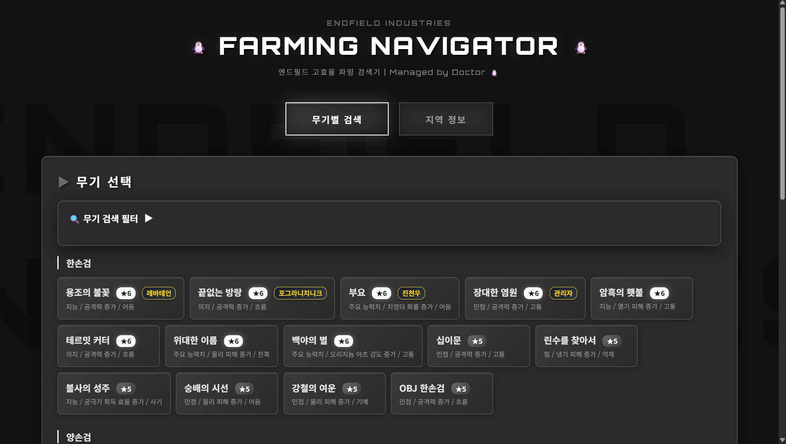

# 🐧 엔드필드 파밍 효율 검색기 (Endfield Farming Navigator)

**명일방주: 엔드필드(Arknights: Endfield)** 의 무기 기질 파밍 효율을 극대화하기 위한 웹 기반 검색 도구입니다.
사용자가 보유한 무기나 목표 무기를 선택하면, 해당 무기들의 기질을 동시에 파밍할 수 있는 최적의 지역과 조합을 찾아줍니다.

### 🔗 **사용 바로가기 (Live Demo)**: [https://bit.ly/endfield-farm](https://bit.ly/endfield-farm)


*(스크린샷을 찍어 프로젝트 폴더에 `preview.png`로 저장하면 여기에 표시됩니다)*

## ✨ 주요 기능

*   **무기별 효율 검색**:
    *   원하는 무기(6성/5성)를 다중 선택하여 기질 파밍 지역을 검색합니다.
    *   선택한 무기들의 기질(기초, 추가, 스킬)이 모두 드랍되는 '엄격한 매칭(Strict Match)' 알고리즘을 적용합니다.
    *   같은 지역에서 파밍 가능한 다른 무기들도 함께 표시하여 파밍 효율을 예측할 수 있습니다.

*   **지역별 정보 확인**:
    *   '4번 협곡', '무릉' 등 지역별로 드랍되는 모든 기질 정보를 한눈에 확인할 수 있습니다.
    *   각 지역의 추천 파밍 조합(Best Combo)과 획득 가능한 주요 무기 리스트를 제공합니다.

*   **Wullung Tech 디자인**:
    *   게임 내 '무릉(Wullung)' 지역과 '4번 협곡'의 테마를 반영한 몰입감 있는 UI/UX.
    *   다크 글래스모피즘(Glassmorphism)과 네온 엑센트 컬러를 사용한 미래지향적 디자인.
    *   지역별 테마 컬러 적용 (민트 그린 / 옐로우).

## 🛠️ 기술 스택

*   **Front-end**: HTML5, CSS3, JavaScript (Vanilla)
*   **Fonts**: Google Fonts (Orbitron, Noto Sans KR)
*   **Icons**: 순수 CSS 및 텍스트 기반 아이콘

## 🚀 설치 및 실행 방법

이 프로젝트는 별도의 서버나 빌드 과정 없이 웹 브라우저만 있으면 바로 실행 가능합니다.

**웹에서 바로 사용하기**: [https://bit.ly/endfield-farm](https://bit.ly/endfield-farm)

1.  이 저장소를 클론(Clone)하거나 ZIP 파일로 다운로드합니다.
    ```bash
    git clone https://github.com/your-username/endfield-farming-navigator.git
    ```
2.  폴더 내의 `index.html` 파일을 더블 클릭하여 실행합니다.

## 📂 프로젝트 구조

```
endfield-farming-navigator/
├── css/
│   └── style.css       # 메인 스타일시트 (Wullung Design Theme)
├── js/
│   ├── data.js         # 무기 데이터 및 지역 정보 (JSON 구조)
│   └── script.js       # 검색 로직 및 DOM 조작 스크립트
├── index.html          # 메인 실행 파일
└── README.md           # 프로젝트 설명 파일
```

## 📝 라이선스

이 프로젝트는 팬 메이드 툴이며, 명일방주: 엔드필드(Arknights: Endfield)의 공식 리소스가 포함되어 있을 수 있습니다. 모든 게임 관련 저작권은 **Hypergryph** 및 **GRYPHLINE**에 있습니다.

---
*Managed by Doctor 🐧*
